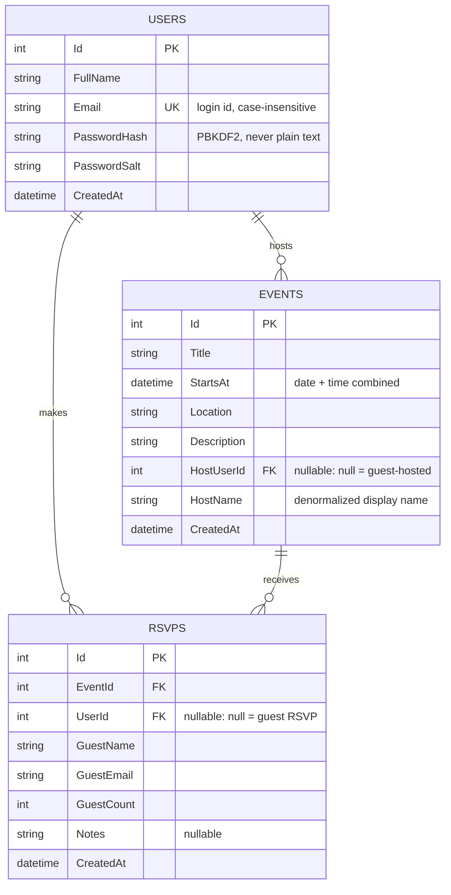

# RSVP App — Data Design Document

## Overview

The app needs local storage for three kinds of things, driven directly by the
functional requirements:

- **Accounts** — so a user can be created and later validated at login.
- **Events** — so events can be added and listed (all / attending / hosting).
- **RSVPs** — the join between a person (account or guest) and an event,
  which is also what "attending" means for the events list.

That maps to three SQLite tables: **Users**, **Events**, **Rsvps**, stored
locally on-device (`RSVPProject.Data.AppDatabase`, one file
`rsvp.db3` in `FileSystem.AppDataDirectory`).

## Entity-relationship diagram

## Tables

### Users

One row per account created through "Create an account."

| Field | Type | Notes |
|---|---|---|
| Id | INTEGER, PK, autoincrement | |
| FullName | TEXT, not null | |
| Email | TEXT, not null, **unique** | normalized to lowercase; the login identifier |
| PasswordHash | TEXT, not null | PBKDF2-SHA256 hash (100k iterations) — the raw password is never stored |
| PasswordSalt | TEXT, not null | random 16-byte salt, unique per user |
| CreatedAt | DATETIME, not null | |

### Events

One row per event, whether created by a signed-in host or a guest.

| Field | Type | Notes |
|---|---|---|
| Id | INTEGER, PK, autoincrement | |
| Title | TEXT, not null | |
| StartsAt | DATETIME, not null | date and start time combined into one column |
| Location | TEXT, not null | |
| Description | TEXT, not null | |
| HostUserId | INTEGER, FK → Users.Id, nullable | **null** when a guest (no account) created the event |
| HostName | TEXT, not null | denormalized snapshot of the host's display name, so the UI always has something to show even when `HostUserId` is null |
| CreatedAt | DATETIME, not null | |

### Rsvps

One row per RSVP against an event. This table is also how "events I'm
attending" is computed (an event is "attending" for user *U* if a row here
has `EventId` = that event and `UserId` = *U*).

| Field | Type | Notes |
|---|---|---|
| Id | INTEGER, PK, autoincrement | |
| EventId | INTEGER, FK → Events.Id, not null | |
| UserId | INTEGER, FK → Users.Id, nullable | **null** for a guest RSVP (no account) |
| GuestName | TEXT, not null | prefilled from the account if logged in, else typed |
| GuestEmail | TEXT, not null | prefilled from the account if logged in, else typed |
| GuestCount | INTEGER, not null (default 1) | |
| Notes | TEXT, nullable | optional note to the host |
| CreatedAt | DATETIME, not null | |

## Relationships

- **Users 1 — \* Events** ("hosts"): `Events.HostUserId` → `Users.Id`,
  nullable so a guest can still create an event without an account.
- **Users 1 — \* Rsvps** ("makes"): `Rsvps.UserId` → `Users.Id`, nullable
  for the same reason — a guest can RSVP without creating an account.
- **Events 1 — \* Rsvps** ("receives"): `Rsvps.EventId` → `Events.Id`,
  required — an RSVP always belongs to exactly one event.

`HostName` on `Events` and `GuestName`/`GuestEmail` on `Rsvps` are
intentionally denormalized (copied at write time rather than only joined
through the FK). That's what lets the list/detail/RSVP screens keep working
identically for guest-created content, which has no `Users` row to join
against.

## Requirement → data mapping

| Requirement | Table(s) | Query/command |
|---|---|---|
| Add a user account | Users | `AppDatabase.AddUserAsync` — hashes the password, rejects a duplicate (case-insensitive) email |
| Log in, validated against stored credentials | Users | `AppDatabase.ValidateLoginAsync` — looks up by email, verifies the PBKDF2 hash |
| Add an event | Events | `AppDatabase.AddEventAsync` |
| List all events | Events | `AppDatabase.GetAllEventsAsync`, ordered by `StartsAt` |
| List events I'm attending | Events + Rsvps | `AppDatabase.GetEventsAttendingAsync(userId)` — events joined through `Rsvps.UserId` |
| List events I'm hosting | Events | `AppDatabase.GetEventsHostedByAsync(userId)` — `Events.HostUserId = userId` |
| View event details | Events | `AppDatabase.GetEventAsync(id)` |
| RSVP for an event, prepopulated when logged in | Rsvps | `AppDatabase.AddRsvpAsync`; the RSVP page prefills `GuestName`/`GuestEmail` from `AppState` (itself populated from the `Users` row at login) |
